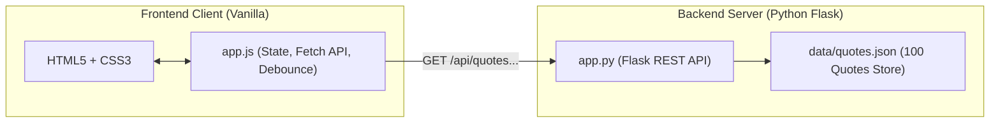

# 🌟 Quotes Explorer (Inspire100)

> A modern, responsive web application displaying 100 curated, well-known quotes from history's most notable thinkers — featuring instant full-text search, multi-category filtering, and random quote generation.

Built with **Python Flask**, **Vanilla JavaScript (ES6+)**, **HTML5**, and **CSS3**. Zero frontend dependencies or complex build steps.

---

## 📸 Overview & Features

- **🎯 100 Timeless Quotes**: High-quality quotes spanning 8 categories: *Wisdom, Philosophy, Science, Motivation, Literature, Leadership, Humor,* and *Life*.
- **🎲 Random Quote Showcase**: Prominent hero card with smooth animations, displaying quote text, author initials avatar, category badge, and unique quote ID.
- **⚡ Real-Time Debounced Search**: Fast, live search by quote keywords or author name with a 200ms input debounce.
- **🏷️ Dynamic Category Pills**: Clickable filter chips showing live counts per category (e.g., `Philosophy (14)`, `Science (12)`).
- **👤 Author Quick-Filter**: Alphabetically sorted dropdown selector to filter quotes by specific authors.
- **📋 One-Click Copy to Clipboard**: Copies formatted quote (`“Quote” — Author`) with toast feedback.
- **⌨️ Keyboard Shortcuts**: Press <kbd>Space</kbd> or <kbd>R</kbd> anywhere on the page to roll a new random quote.
- **📱 Responsive & Elegant Theme**: Designed with an accessible dark palette, typography pairing (*Inter* + *Playfair Display*), elevation cards, and mobile-friendly layouts.

---

## 🏛️ System Architecture



- **Server-Side ([app.py](file:///C:/Users/pancr/OneDrive/Documents/agy-cli-projects/app.py))**: Loads [data/quotes.json](file:///C:/Users/pancr/OneDrive/Documents/agy-cli-projects/data/quotes.json) into memory once at startup for $O(N)$ query speeds.
- **Client-Side ([static/js/app.js](file:///C:/Users/pancr/OneDrive/Documents/agy-cli-projects/static/js/app.js))**: Centralized state store managing filters and DOM updates using `document.createDocumentFragment()` for efficient batch rendering.

---

## 🔌 REST API Reference

All endpoints return JSON and adhere to standard HTTP status codes.

### 1. `GET /api/quotes/random`
Fetches a single random quote.

| Parameter | Type | Description |
| :--- | :--- | :--- |
| `category` | `string` *(optional)* | Filter by category name (e.g., `Science`) |
| `author` | `string` *(optional)* | Filter by author name (e.g., `Einstein`) |

**Example Response:**
```json
{
  "id": 2,
  "quote": "In the middle of difficulty lies opportunity.",
  "author": "Albert Einstein",
  "category": "Wisdom"
}
```

---

### 2. `GET /api/quotes`
Searches and filters quotes.

| Parameter | Type | Description |
| :--- | :--- | :--- |
| `query` | `string` *(optional)* | Substring match against quote text and author name |
| `category` | `string` *(optional)* | Category filter (case-insensitive) |
| `author` | `string` *(optional)* | Author filter (case-insensitive) |

**Example Response:**
```json
{
  "total": 1,
  "quotes": [
    {
      "id": 1,
      "quote": "The only way to do great work is to love what you do.",
      "author": "Steve Jobs",
      "category": "Motivation"
    }
  ]
}
```

---

### 3. `GET /api/categories`
Returns an alphabetical list of categories and quote counts.

**Example Response:**
```json
{
  "total": 8,
  "categories": [
    { "name": "Humor", "count": 6 },
    { "name": "Leadership", "count": 10 },
    { "name": "Life", "count": 9 },
    { "name": "Literature", "count": 8 },
    { "name": "Motivation", "count": 16 },
    { "name": "Philosophy", "count": 15 },
    { "name": "Science", "count": 13 },
    { "name": "Wisdom", "count": 23 }
  ]
}
```

---

### 4. `GET /api/authors`
Returns an alphabetically sorted array of all unique authors.

---

## 📂 Project Structure

```
panv-famous-quotes/
├── app.py                  # Flask server and REST API routes
├── requirements.txt        # Python package dependencies
├── README.md               # Project documentation
├── .gitignore              # Git ignore rules for Python, virtualenv, and OS files
├── data/
│   └── quotes.json         # 100 curated quotes dataset
├── static/
│   ├── css/
│   │   └── style.css       # Responsive dark theme styling
│   └── js/
│       └── app.js          # Vanilla JavaScript application & state logic
├── templates/
│   └── index.html          # Semantic HTML5 template
└── tests/
    └── test_app.py         # Pytest automated test suite (13 tests)
```

---

## 🚀 Getting Started

### Prerequisites
- Python 3.10+ installed

### 1. Clone or Navigate to Project
```bash
git clone https://github.com/PancratiusV/panv-famous-quotes.git
cd panv-famous-quotes
```

### 2. Set Up Virtual Environment

**On Windows (PowerShell):**
```powershell
python -m venv .venv
.\.venv\Scripts\Activate.ps1
pip install -r requirements.txt
```

**On macOS / Linux:**
```bash
python3 -m venv .venv
source .venv/bin/activate
pip install -r requirements.txt
```

### 3. Run the Development Server

```powershell
python app.py
```
*(Or with active venv: `.\.venv\Scripts\python.exe app.py`)*

Open your browser and navigate to:
```
http://127.0.0.1:5000
```

---

## 🧪 Running Automated Tests

Run the test suite with `pytest`:

```powershell
.\.venv\Scripts\python.exe -m pytest -v
```

All 13 unit tests verify:
- ✅ Integrity of all 100 quotes (valid IDs, authors, quotes, categories)
- ✅ Home page and static assets (HTML, CSS, JS MIME types)
- ✅ API endpoints (`/random`, `/quotes`, `/categories`, `/authors`)
- ✅ Case-insensitive text and author searching
- ✅ Category filtering and 404 error handling

---

## 📄 License
This project is open source and available under the [MIT License](LICENSE).
